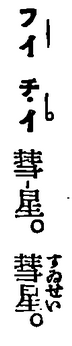
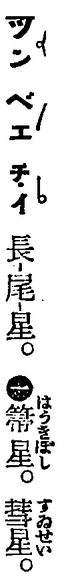
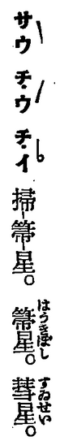
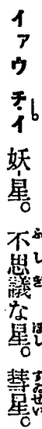

* coordinate system = chō-phiau-hē (座標系); chham-khó-hē (參考系)
  * [GT] Ji̍tgí: [座標 (ざひょう)](https://ja.wikipedia.org/wiki/%E5%BA%A7%E6%A8%99)
  * [SB]
    Ti̍tchiap chioh Ji̍tgí jīsû, hoat Tâigí im.

    **Chō** sī ūitì, **phiau** sī phiausī.
    Ìsù ū ha̍h.

    Lēnggōa chit ê siūⁿhoat, khólū coordinate púnté sī beh thêkiong chit ê
    "hō͘ ta̍kê chò chhamkhó ê hēthóng," só͘í mā ētàng hō-chò chham-khó-hē (reference frame).

* comet = hūi-chhiⁿ (慧星), tn̂g-bóe-chhiⁿ (長尾星), sàu-chhiú-chhiⁿ (掃箒星), iau-chhiⁿ (妖星)
  * [SB]
    TJT ū siu chiah-ê jīsû:

    
    
    
    
