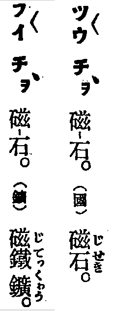

* electric field = tiān-tiûⁿ (電場)
  * [GT] Ji̍tgí: [電場 (でんば)](https://ja.wikipedia.org/wiki/%E9%9B%BB%E5%A0%B4) => Hôagí:電場
  * [SB]
    Ti̍tchiap chioh Ji̍tgí jīsû, hoat Tâigí im.

* electromagnetic wave = tiān-chû-pho (電磁波)
  * [GT] Ji̍tgí: [電磁波 (でんじは)](https://ja.wikipedia.org/wiki/%E9%9B%BB%E7%A3%81%E6%B3%A2) => Hôagí:電磁波
  * [SB]
    Chit ê jīsû ê Ji̍tpún Hànjī "電磁波" tī Tâigí lāité ētàng ti̍tchiap líkái chò 
    "tiān-tiûⁿ (electric field)", "chû-tiûⁿ (magnetic field)", kap "pho (wave)" saⁿ-hāng iàusò͘.

    Kîtiong "磁" jī tī Tâigí lāité ê hoat-im ná chhiūⁿ bô "chû" ê im.
    Tī 台日大辭典 lāité, "磁石" ū "chû-chio̍h" kap "hûi-chio̍h" nn̄g tiâu.

    

    <a href="#chu5">In-ūi</a> tī Tâigí lāité, "hûi-á" íkeng ū Porcelain ê ìsù,
    só͘í góa chútiuⁿ kā "hûi" póliû hō͘ goânté ê "hûi-á",
    iōng "chû" lâi chhengho͘ "magnetic" ê siongkoan hiānsiōng kap bu̍tthé.

* enzyme = kàⁿ-sò͘ (酵素)
  * [GT] Ji̍tgí: [酵素 (こうそ)](https://ja.wikipedia.org/wiki/%E9%85%B5%E7%B4%A0)
  * [SB]
    Tâigí ū "hoat-kàⁿ" ê kónghoat, só͘í chit ê jīsû ti̍tchiap chioh Ji̍tgí jīsû, hoat Tâigí im.

