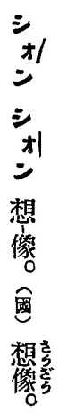

* imagination = sióng-siōng, sióng-siōng-le̍k (想像, 想像力)
  * [GT] Ji̍tgí: [想像力 (そうぞうりょく)](https://ja.wikipedia.org/wiki/%E6%83%B3%E5%83%8F%E5%8A%9B)
  * [SB]
    Ti̍tchiap chioh Ji̍tgí jīsû, hoat Tâigí im.

    

* inertia = koàn-sèng (慣性)
  * [GT] Ji̍tgí: [慣性 (かんせい)](https://ja.wikipedia.org/wiki/%E6%85%A3%E6%80%A7)
  * [SB]
    Ti̍tchiap chioh Ji̍tgí jīsû, hoat Tâigí im.

    Koàn-sèng ê "慣" tī Tâigí lāité ū "îchhî goânpún chōngthài" ê ìsù, só͘í ti̍tchiap chháiiōng Ji̍tgí sû.

