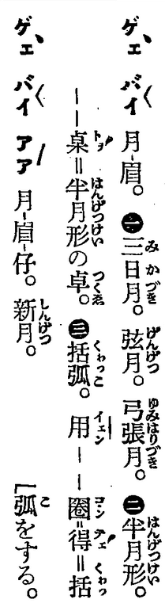

* magnetic field = chû-tiûⁿ (磁場)
  * [GT] Ji̍tgí:[磁場 (じば)](https://ja.wikipedia.org/wiki/%E7%A3%81%E5%A0%B4) => Hôagí:磁場
  * [SB]
    Ti̍tchiap chioh Ji̍tgí jīsû, hoat Tâigí im.
    
    "磁" ê hoat-im chhiáⁿ chhamkhó [E](../E/E_list.md#chu5) ê "electromagnetic wave".
    
* metabolism = tāi-siā (代謝)
  * [GT] Ji̍tgí: [代謝 (たいしゃ)](https://ja.wikipedia.org/wiki/%E4%BB%A3%E8%AC%9D)
  * [SB]
    Ti̍tchiap chioh Ji̍tgí jīsû, hoat Tâigí im.

* moon
  * new moon = goe̍h-bâi-á (月眉仔) 
  * crescent moon = goe̍h-bâi (月眉) 
  * quarter moon = goe̍h-pêng
  * full moon = goe̍h-îⁿ (月圓)
  * [SB]
    Chhamkhó 台日大辭典：

    
