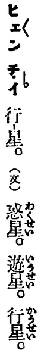
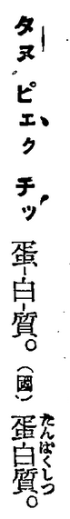

* peptide = phép-thāi-tò
  * [SB]
    Ùi Enggí hoat-im lâi im-e̍k.

    Hôagí sī 多肽/胜肽.

* period = chiu-kî (周期)
  * [SB]
    
* planet = hêng-chhiⁿ (行星), iû-chhiⁿ (遊星)
  * [SB]
    TJT lāité ū siu chit-ê sû.

    Suibóng púnté ū **hêng-chhiⁿ** chit-ê kónghoat,
    m̄koh khólū i kap **恒星** kāng im,
    só͘í kiàngī sú-iōng **iû-chhiⁿ**.

    _Planet_ goânté ê ìsù sī _wanderer_, tō sī **liû-lōng chiá**.
    **iû-chhiⁿ** tú-hó ētàng tùi-èng chit-ê ìsù.

    
    
* polymerase = pho-lí-mō-lē-sù
  * [SB]
    Ùi Enggí hoat-im lâi im-e̍k.

    Hôagí sī 聚合酶.

* position = ūi-tì (位置)
  * [GT] Ji̍tgí: [位置 (いち)](https://ja.wikipedia.org/wiki/%E4%BD%8D%E7%BD%AE)
  * [SB]
    Ti̍tchiap chioh Ji̍tgí jīsû, hoat Tâigí im.

* protein = phu-ló͘-thìn, tān-pe̍k-chit (蛋白質)
  * [GT] Enggí, Ji̍tgí: [タンパク質 (タンパクしつ、蛋白質)](https://ja.wikipedia.org/wiki/%E3%82%BF%E3%83%B3%E3%83%91%E3%82%AF%E8%B3%AA)
  * [SB]
    Tī TJT lāité ū siu "tān-pe̍k-chit (蛋白質)":

    

    M̄koh tī Ji̍tgí ê Wiki bāngia̍h, ū kóng tio̍h:

    > 「蛋」という漢字は、例えば皮蛋のように中国ではよく使われる字であるが、日本ではあまり普及していない。そのため栄養学者の川島四郎が「蛋白質」では分かりにくいとして「卵白質」という語を使用したが、一般的に利用されるにはいたらなかった。 現在では、栄養学分野では平仮名の「たんぱく質」、生物学では片仮名の「タンパク質」が使われる傾向にある。

    Google translator ê Enggí hoane̍k sī:

    > The kanji "protein" is a character that is commonly used in China like skin protein, for example, it is not widely used in Japan. Therefore, as a nutritionist Shiro Kawashima used the word "egg white" as being difficult to understand in "protein", it was not generally used. Today, there is a tendency to use "protein" of hiragana in the field of nutrition, and "katakana" protein in biology.

    Ùi chia ê chuliāu lâi thuichhek, íchá Ji̍tpún chháiiōng "蛋白質",
    āulâi inūi "蛋白" kap "protein" oh liânsióng, só͘í kái chò "タンパク質".

    Chiàu ánne lâi khòaⁿ, Tâigí ê hoane̍k kiàngī iōng ime̍k **phu-ló͘-thìn**.
    
* proton = iông-chú (陽子)
  * [GT] Ji̍tgí: [陽子 (ようし)](https://ja.wikipedia.org/wiki/%E9%99%BD%E5%AD%90)
  * [SB]
    _Proton_ púnsin tài iông-tiān, hō chò **iông-chú** chin ha̍h i ê te̍ksek.
