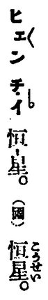

* scalar = su-ké-loh; sûn-liōng
  * [GT] Enggí
  * [GT] Hôagí: 純量
  * [SB]
    Nā í Hôagí ê "純量" lâi ti̍t-hoan, ētàng hō chò "sûn-liōng".
    Ùi Hôagí Hànjī lâi líkái, tō sī "tan-sûn ê liōng".
    M̄koh chit ê ìsù góa kòjîn kámkak ū áu khah ngē,
    só͘í bô kiàngī chháiiōng "sûn-liōng" chit ê hoane̍k.

    Chit ê sû tī Ji̍tgí lāité bô Hànjī,
    só͘í bô tè chhamkhó.

    Khólū "scalar/vector/tensor", chit cho͘ sû èngkai chháiiōng kāngkhóan ê hoane̍k hongsek.

* slope [math] = chhiâ-tō͘, chhoa̍h-tō͘ (斜度) 
  * [SB]
    Hôagí hō chò "斜率".

    Púnté ū kúi-á-ê hāusoán-jīsû:
    * chhu-tō͘ (趨度)
    * khi-tō͘ (欹度)
    * siâ-tō͘ (斜度)

    Khólū **chhu** ū "chhu--tó" ê tōngchok; 
    **khi** ū "piáubīn bô pêⁿthán" ê ìsù;
    **siâ** kap 邪 kāng-im;
    só͘í koattēng chháiiōng *chhiâ-tō͘/chhoa̍h-tō͘* lâi piáusī _slope_.

* slope [physics] = chhiâ-bīn, chhoa̍h-bīn (斜面) 
  * [SB]
    Chhiáⁿ chhamkhó "slope [math]".

* speed = sok-pí (速比) 
  * [SB]
    Hôagí hō chò "速率".

    Púnté ū kúi-á-ê hāusoán-jīsû:
    * kín-bān (緊慢)
    * khoài-bān (快慢)
    
    Khólū **kín-bān** púnté ū "chá-chha-bān" ê ìsù,
    só͘í bô sekha̍p the̍h lâi iōng tī chia.

    Góa tùi **khoài-bān** bo̍kchêng bô te̍kpia̍t ê siūⁿhoat.

    _Sok-pí_ koh tú-hó kap _speed_ lio̍hlio̍h-á kāng-im, só͘í iusian chháiiōng.

* star = chhiⁿ, hêng-chhiⁿ (恒星)
  * [GT] Ji̍tgí: [恒星 (こうせい)](https://ja.wikipedia.org/wiki/%E6%81%92%E6%98%9F)
  * [SB]
    TJT ū siu chit-ê jīsû.
    
    

* state = chōng-thài (狀態) 
  * [GT] Ji̍tgí: [状態 (じょうたい)](https://ja.wikipedia.org/wiki/%E7%8A%B6%E6%85%8B)
  * [SB]
    Ti̍tchiap ùi Ji̍tgí Hànjī tha̍k Tâigí-im.

    Chit ê sû tī bo̍kchêng ê ji̍tsiông Tâigí lāité oan-ná sī ū teh sú-iōng.
